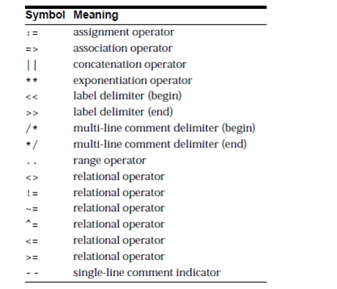

# Comparison Operators<sub> Advanced</sub>
>>* [IN ](https://www.techonthenet.com/oracle/in.php)
>>* [NOT](https://www.techonthenet.com/oracle/not.php)
>>* [BETWEEN](https://www.techonthenet.com/oracle/not.php)
>>* [IS NULL](https://www.techonthenet.com/oracle/isnull.php)
>>* [IS NOT NULL](https://www.techonthenet.com/oracle/isnotnull.php)
>>* [LIKE](https://www.techonthenet.com/oracle/like.php)
>>* [REGEXP_LIKE](https://www.techonthenet.com/oracle/regexp_like.php)
>>* [EXISTS](https://www.techonthenet.com/oracle/exists.php)
# Delimaters : ```important```

 