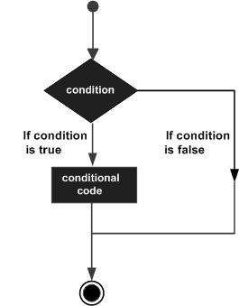

# **IF-THEN-ELSIF Statement**<sub> Conditions</sub>
# ```SYNTAX:```

)
```sql
IF(boolean_expression 1)THEN  
   S1; -- Executes when the boolean expression 1 is true  
ELSIF( boolean_expression 2) THEN 
   S2;  -- Executes when the boolean expression 2 is true  
ELSIF( boolean_expression 3) THEN 
   S3; -- Executes when the boolean expression 3 is true  
ELSE  
   S4; -- executes when the none of the above condition is true  
END IF;
```
# ```Example:```
```sql
Declare
varInt number(20):=60;
begin
if(varInt=50) then
dbms_output.put_line('Value is 50');
elsif(varInt>50) then
dbms_output.put_line('Value is greater then 50');
elsif(varInt<50) then
dbms_output.put_line('Value is Smaller then 50');
else
dbms_output.put_line('Unknown Value is provided');
end if;
end;
/
```
```sql
--OUTPUT 

   Value is greater then 50

   Statement processed.

   0.01 seconds
```


