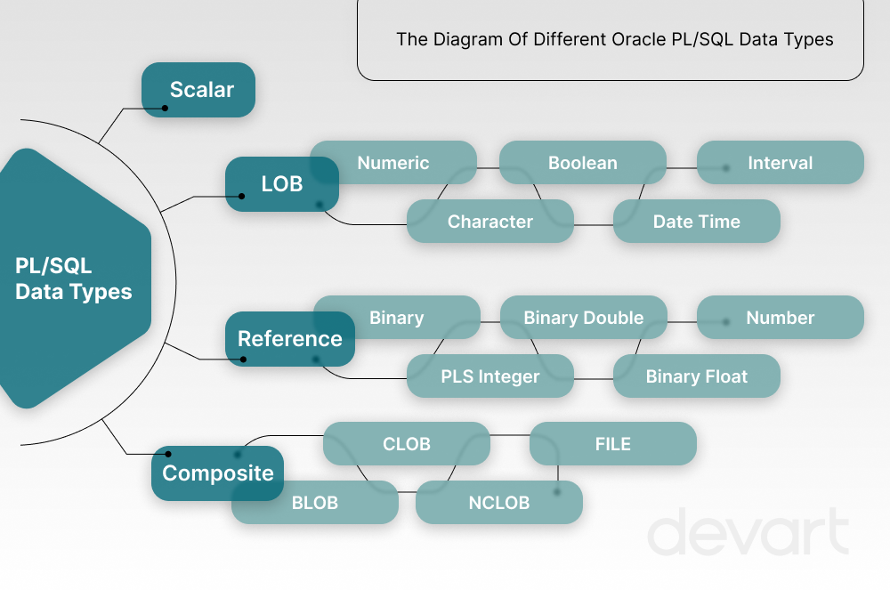

# Data Types



## Variables <sub>Declaration and value Assigning</sub>
```sql
DECLARE
 -- Variable Initialization 
   varInt number:=500;
   decNum number(10,2):=100.566666666;
 /*              ↓  ↓
            Length  Decimal Points
*/
   myName varchar(100):='Suryansh';
   myDate date:=sysdate;

   -- Constants
   g CONSTANT number(10,2):=9.80665; 

begin
  dbms_output.put_line(varInt);
  dbms_output.put_line(myName);
  dbms_output.put_line(myDate );
  dbms_output.put_line(decNum);
  dbms_output.put_line(g);
  
  
end;
/
```
```sql
--OUTPUT: 

    500
    Suryansh
    01/11/2024
    9.81
    
Statement processed.

0.01 seconds

```