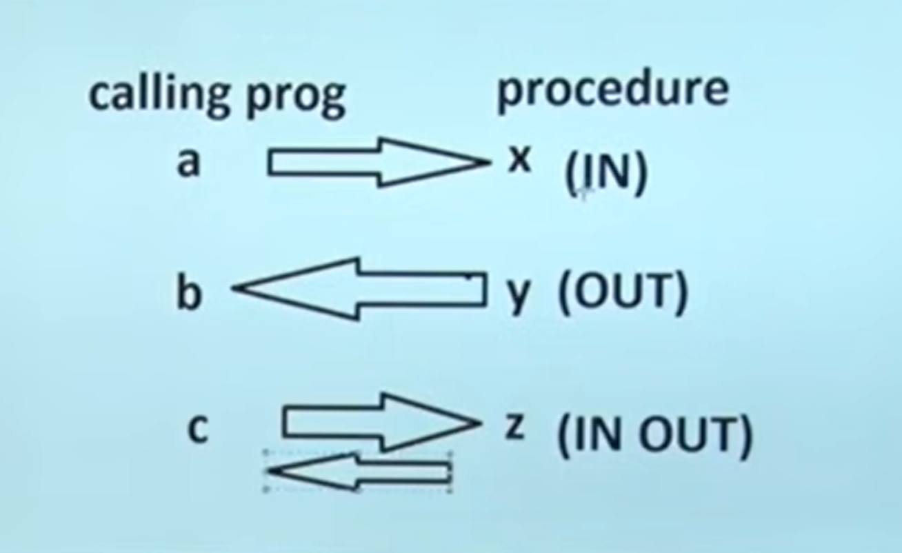

# Procedures
## __Procedures is also names as PL/SQL Block that accepts some input in the form of parameter and perform some task and may or may not return a value.__

# Syntax
```sql
CREATE OR REPLACE PROCEDURE <procedure_name>(Parameter if any) 
{IS | AS} 

BEGIN 
  < procedure_body > 
END procedure_name; 
```
# Type of Parameter
There are 3 types;
# 1. `IN` --> Default 
## It always receive the value send by the Caller

# 2. `OUT`
## It always send the value 
# 3. `IN OUT`
## Sends as well as receive the values

