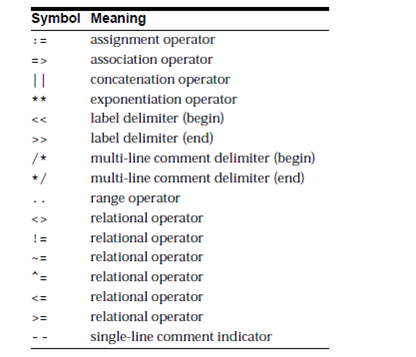

<!-- <style>
  #table-of-contents {
    background-color: gray;
    padding: 10px;
    border-radius: 10px;
    display:'flex';
    align-items:'center';
    justify-content:'center';
    padding-left:80px;
  }

  #table-of-contents {
    text-align:'center';
    color: white;
    font-size:50px;
    font-weight:400;
  }
h2{
    text-decoration:none;
    color:white;
  }
</style> -->

# Table of Contents

> ## 1 Basics [[__Go__]]()
> ## 2 Data Type and Variables[[__Go__]]()
> 
# Delimaters : ```important```

 
 
 # Comparison Operators<sub> Advanced</sub>
>>* [IN ](https://www.techonthenet.com/oracle/in.php)
>>* [NOT](https://www.techonthenet.com/oracle/not.php)
>>* [BETWEEN](https://www.techonthenet.com/oracle/not.php)
>>* [IS NULL](https://www.techonthenet.com/oracle/isnull.php)
>>* [IS NOT NULL](https://www.techonthenet.com/oracle/isnotnull.php)
>>* [LIKE](https://www.techonthenet.com/oracle/like.php)
>>* [REGEXP_LIKE](https://www.techonthenet.com/oracle/regexp_like.php)
>>* [EXISTS](https://www.techonthenet.com/oracle/exists.php)

# **IF-THEN-ELSIF Statement**<sub> Conditions</sub>
# ```SYNTAX:```
```sql
IF(boolean_expression 1)THEN  
   S1; -- Executes when the boolean expression 1 is true  
ELSIF( boolean_expression 2) THEN 
   S2;  -- Executes when the boolean expression 2 is true  
ELSIF( boolean_expression 3) THEN 
   S3; -- Executes when the boolean expression 3 is true  
ELSE  
   S4; -- executes when the none of the above condition is true  
END IF;
```
# ```Example:```
```sql
Declare
varInt number(20):=60;
begin
if(varInt=50) then
dbms_output.put_line('Value is 50');
elsif(varInt>50) then
dbms_output.put_line('Value is greater then 50');
elsif(varInt<50) then
dbms_output.put_line('Value is Smaller then 50');
else
dbms_output.put_line('Unknown Value is provided');
end if;
end;


--OUTPUT 

   Value is greater then 50

   Statement processed.

   0.01 seconds
```


