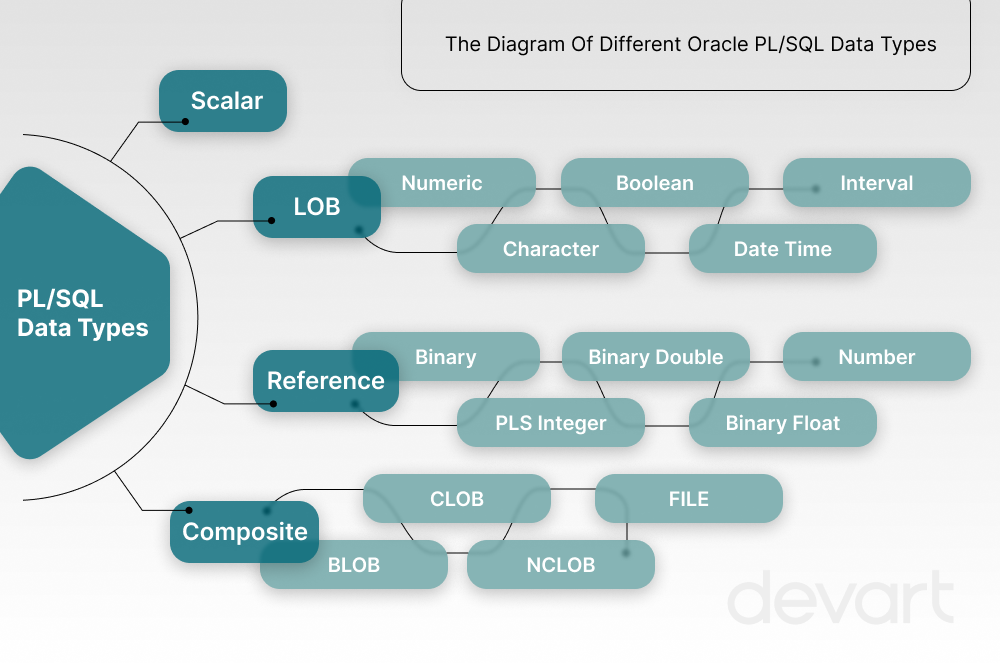

# PLSQL

### PL/SQL stands for Procedural Language extensions to the Structured Query Language (SQL). It's a block-structured language that combines SQL with the procedural features of programming languages. PL/SQL is a high-performance, highly integrated database language that performs best with Oracle database server

# Basic Syntax
```sql
DECLARE -- All the Variable and methode should be define here it is OPTIONAL.
   <declarations section> 
BEGIN -- Start Point
   <executable command(s)>
EXCEPTION
   <exception handling> 
END;  -- End Point
```
## Exmaple :-

```sql
DECLARE 
   message  varchar2(20):= 'Hello, World!'; 
BEGIN 
   dbms_output.put_line(message); 
END; 
/ 
```
OUTPUT 
```Console```
```md
Hello World

PL/SQL procedure successfully completed.
```

# Data Types


# Variables <sub>Declaration and value Assigning</sub>
```sql
DECLARE
 -- Variable Initialization 
   varInt number:=500;
   decNum number(10,2):=100.566666666;
 /*              ↓  ↓
            Length  Decimal Points
*/
   myName varchar(100):='Suryansh';
   myDate date:=sysdate;

   -- Constants
   g CONSTANT number(10,2):=9.80665; 

begin
  dbms_output.put_line(varInt);
  dbms_output.put_line(myName);
  dbms_output.put_line(myDate );
  dbms_output.put_line(decNum);
  dbms_output.put_line(g);
  
  
end;
/

OUTPUT: 

    500
    Suryansh
    01/11/2024
    9.81
    
Statement processed.

0.01 seconds

```
# Delimaters : ```important```

 
 
> # Comparison Operators<sub> Advanced</sub>
>>* [IN ](https://www.techonthenet.com/oracle/in.php)
>>* [NOT](https://www.techonthenet.com/oracle/not.php)
>>* [BETWEEN](https://www.techonthenet.com/oracle/not.php)
>>* [IS NULL](https://www.techonthenet.com/oracle/isnull.php)
>>* [IS NOT NULL](https://www.techonthenet.com/oracle/isnotnull.php)
>>* [LIKE](https://www.techonthenet.com/oracle/like.php)
>>* [REGEXP_LIKE](https://www.techonthenet.com/oracle/regexp_like.php)
>>* [EXISTS](https://www.techonthenet.com/oracle/exists.php)

# **IF-THEN-ELSIF Statement**<sub> Conditions</sub>
# ```SYNTAX:```
```sql
IF(boolean_expression 1)THEN  
   S1; -- Executes when the boolean expression 1 is true  
ELSIF( boolean_expression 2) THEN 
   S2;  -- Executes when the boolean expression 2 is true  
ELSIF( boolean_expression 3) THEN 
   S3; -- Executes when the boolean expression 3 is true  
ELSE  
   S4; -- executes when the none of the above condition is true  
END IF;
```
# ```Example:```
```sql
Declare
varInt number(20):=60;
begin
if(varInt=50) then
dbms_output.put_line('Value is 50');
elsif(varInt>50) then
dbms_output.put_line('Value is greater then 50');
elsif(varInt<50) then
dbms_output.put_line('Value is Smaller then 50');
else
dbms_output.put_line('Unknown Value is provided');
end if;
end;


--OUTPUT 

   Value is greater then 50

   Statement processed.

   0.01 seconds
```

